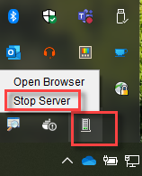
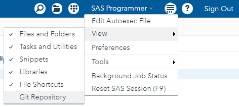
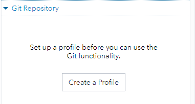

# connect sas studio to git

sas studio supports only ssh and https to connect to a git server. Here we use https.

In sas studio v3.81 basic, the https options are not enabled by default. We'll need to modify the config settings to allow it. This weill require admin access to our machine (program files area).

Edit config.properties for sas studio, found in %PROGRAMFILES%\SASStudioSingleUser\3.81\war\config\config.properties. These are the lines to alter (both values should be **true**).



```
#--- for turning off Git username and password fields
webdms.showGitPassword=true
#--- for turning off Git functionality
webdms.allowGit=true
```

1. make sure the gir repository view is enabled.



2. create a profile



