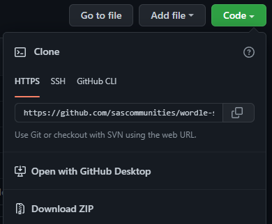
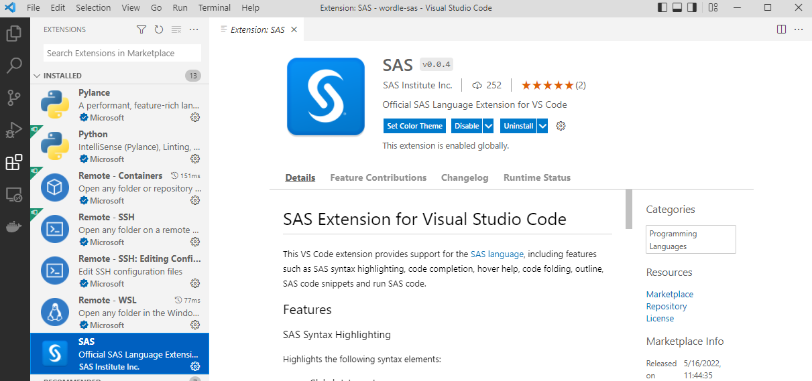
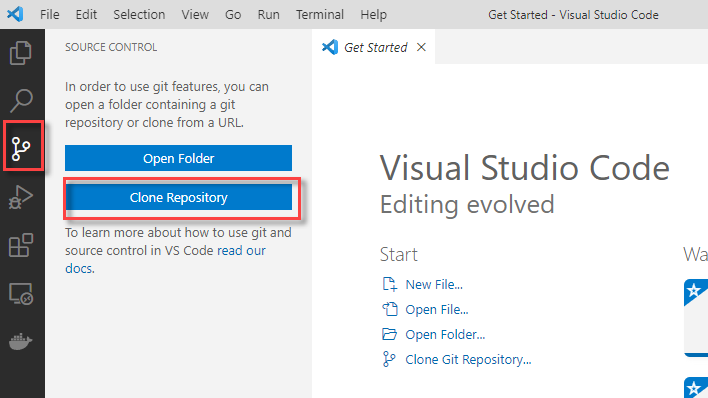
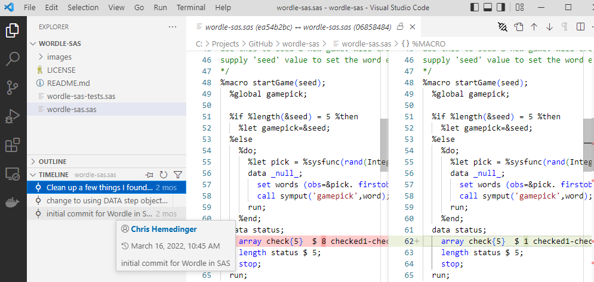

# clone a sas project from github

here we will use git clone to bring an existing project from github to a local repo.

1. launch git sas and **cd** to the root folder for the git projects

2. in a web browser, use the code dropdown to find the https address to use to clone the project.

    

3. git clone
    ```
    git clone "url"
    ```

    change directory (cd) to the new folder:
    ```
    cd ./new_folder
    ```

## vs code

vs code offers built-in support for git and [SAS programming language](https://marketplace.visualstudio.com/items?itemName=SAS.sas-lsp).



after installing the extension, clone and explore a repository that contains sas program files. this is a good one:
```
https://github.com/sassoftware/covid-19-sas.git
```



launch vs code for this project:
    ```
    code .
    ```

this will open a vs code window for the current folder. use the timeline tab to explore the git history for the project.



